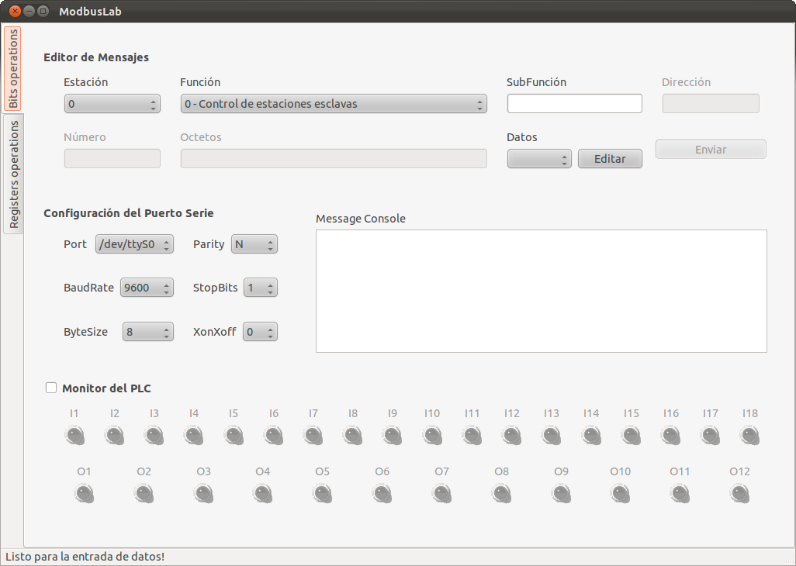
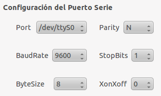
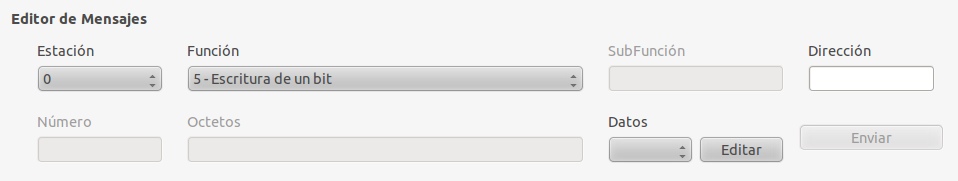
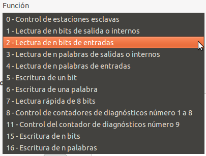
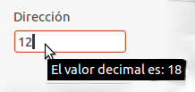
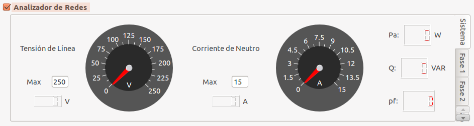

Orientaciones para el laboratorio de Modbus 
===========================================

El mapeo de memoria del PLC Master-k120s se puede encontrar en la página
8-59 del documento
[Master-k-Comm.pdf](http://univirt.em.reduc.edu.cu/mod/resource/view.php?id=690)
y para el analizador de redes en la página 7 del documento
[WM14BXCPv2r0ENG0804.pdf](http://univirt.em.reduc.edu.cu/mod/resource/view.php?id=691).

Tareas: 
-------

Se pide una variante por estudiante que debe verse en el documento
[Variantes.pdf](http://univirt.em.reduc.edu.cu/mod/resource/view.php?id=692).
Usted deberá ejecutar las siguientes acciones:

**PLC**

-   -   -   -   -   -   -   

**Analizador**

-   -   

\

\* Entre paréntesis se muestra la columna que contiene la información
para su variante.

\

 El
estudiante debe traer al laboratorio elaborado los mensajes que va a
enviar, por ejemplo:

Acción

Mensaje

Activar la salida P4C

Esclavo

Función

Dirección

Dato/Cantidad

2

05

 04C0

 FF00

Leer la energía del analizador

1

04

02C6

1

\

\

El software ModbusLab se presenta como puede verse en la figura 1.

\
*Figura 1: Ventana principal de Modbuslab.*

En la figura 2 se muestra el área para la configuración del puerto
serie. En esto es suficiente con dejar los valores predeterminados
puesto que así han sido configurados todos los nodos de la red.

\
*Figura 2: Configurador del puerto serie.*

\
El editor de mensajes se puede ver en la figura 3. El primer campo hacer
referencia a la dirección del esclavo con el que se establecerá la
conexión (Estación). El segundo campo determina la función del mensaje
(véase en detalle en la figura 3) y determina los campoes que estarán
activos e inactivos. Es importante notar que todas la entradas numéricas
son de valores hexadecimales, el valor decimal será siempre accesible en
un tip como puede verse en la figura 5.

{width="100%"}\

 *Figura
3: Editor de mensajes.*

 [
]

{width="100%"}\
*Figura 4: Selector de la función modbus.*
\

{width="100%"}\
*Figura 5: Entrada numérica.*

El monitor del analizador de redes nos permite conocer todo el tiempo
los valores medidos por el equipo como se muestra en la figura 6. La
escala de los instrumentos de aguja se puede modificar a través de una
entrada numérica como indica la figura 6.

{width="100%"}\

 *Figura
6: Monitor del analizador de redes.*

\

\

En el menú herramientas podemos encontrar la utilidad para configuración
del PLC como se en la figura 8. Esta interfaz nos permite definir el
número de entradas y salidas así como la dirección base de las mismas en
la memoria del PLC. En este caso la base numérica puedes ser decimal o
hexadecimal según sea más conveniente. Esta configuración hace flexible
al programa para interactuar con cualquier autómata. Se puede escoger el
color para la visualización de los leds como se muestra en la figura 8.

Una vez terminado el laboratorio el software permite generar un informe
con el menú que se muestra en la figura 7.
\
{width="100%"}\
*Figura 7: Menú para generar informe.*

\

{width="100%"}\

 *Figura
8: Configurador del PLC*

